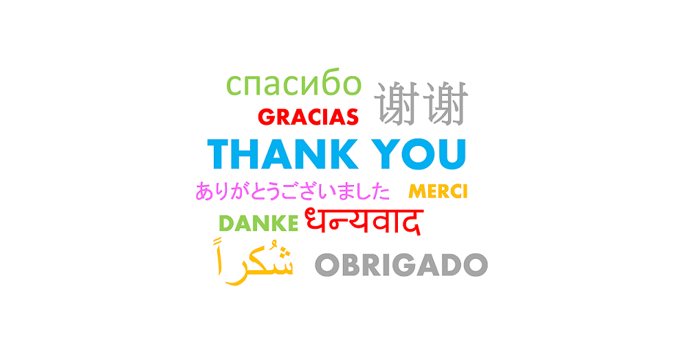

Natural Language Processing - Word Prediction
========================================================
author: Sanjay Somraj
date: 08 Aug 2017
autosize: true

Data Sciences Capstone Project - Introduction
========================================================

This presentation and the related Shiny app have been developed as a part of the Coursera Data Sciences Specialization Capstone project.

- Natural language processing (NLP) is a field of computer science, artificial intelligence and computational linguistics concerned with the interactions between computers and human (natural) languages.
- In particular, NLP is concerned with programming computers to fruitfully process large natural language corpora.

How things work?
========================================================

1. A large corpus of blog, news and twitter data was loaded and analyzed. N-gram model with stupid back-off strategy was used as the prediction algorithm

2. N-grams were extracted from the corpus and then used for building the predictive model. For this application, only UniGrams, BiGrams and TriGrams have been taken in to consideration.

3. The shiny app has 3 tabs-

     a.   Word Predictions: Caters to the suggestive words based on the input word/phrase
     
     b.   Stats Info: Provides basic information on the files used 
     
     c.   Help: General help on how to use the Shiny app 

How to use?
========================================================
- User enter the word or phrase, selects the number of predictions they wish to see and hit the Submit button in the left side-bar panel. 
- The results are displayed in main content panel.

       

Next Steps
========================================================

The prediction model can be improvised further -

- Increasing the Corpus size can be increased to include many more word/phrase combinations. This will increase the accuracy of the predictions. 

- Cleansing Corpus data to eliminate non-english words and non-ASCII characters. 

- Extending the prediction over to QuadGrams, PentaGrams and HexaGrams. This will increase the word prediction to be more apt to the user input phrase. 
     
- Optimal utilization of resources like memory and processor. The current model's performance is limited to the machine resources.

Please access the Shiny app here: https://sanjaysomraj.shinyapps.io/capstoneproject/

========================================================
   
   
   
